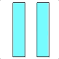

Animating Paths

This app demonstrates animating paths in a CAShapeLayer using a CABasicAnimation. It creates a pretty common animation: Animating a pause icon back and forth into a play icon. The animation looks like this:



The trick to animating paths in iOS is that the starting and ending path need to have the same number of endpoints.

For the play/pause button animation, we start with the pause icon, which is 2 rectangles. We animate that path into a triangle which is actually composed of 2 quadralaterals. On the left we morph the rectangle into a trapezoid, and on the right we animate that rectangle into a quadralateral where the 2 right points are at the same position, so it looks like a triangle.

This project implements a general-purpose subclass of UIView `AnimatePathsView` that will animate an array of different paths using an array of structs called `PathStep`s.

A `PathStep` looks like this:

```
/// A struct to define a path and the duration, pause, and timing function to use for an animation step.
struct PathStep {
    var path: CGPath
    var stepDuration: Double?
    var stepPause: Double?
    var timingFunction: CAMediaTimingFunctionName?
}
```

The only required property for a `PathStep` is a CGPath. The other properties are all optional, and the `AnimatePathsView` will use default values if they are nil.

The `AnimatePathsView` has a method `animate(repeats:)` which will create a multi-step animation that animates the path from the first path in the `paths` array to the end.

Each CGPath in the `paths` array must have the same number of endpoints or you will get unpredictable results.

Currently the `AnimatePathsView` class animates the path from the first path in the `paths` array to the last, and then back to the first path.

The sample project's view controller has an `AnimatePathsView` which it populates with 2 path steps, one for the pause icon's 2 rectangles, and one for the play button (as 2 closed paths with 4 endpoints each.) 

Its animate button simply calls the `AnimatePathsView`'s `animate(repeats:)` function.

At some point I may update the `AnimatePathsView` so it allows you to animate a subset of the paths in the `paths` array.